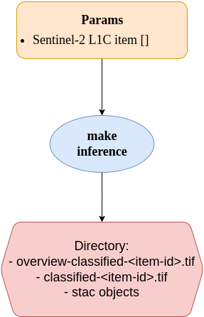

# Provide an Inference Using Trained Model

In the [s5-newMLModel.ipynb](../../training/trials/s5-newMLModel.ipynb) notebook, the user trained a CNN model on EuroSAT to classify image chips into 10 different classes and tracked the workflow with MLFlow.

With this Application Package, the user performs inference by applying the trained model to unseen data to generate a classified image. This Application Package consists of one main module:

- `make-inference`

> **Note**: Please check the `make-inference` [documentation](../make-inference/README.md) regarding its usage before proceeding.

The Application Package takes as input a (list of) Sentinel-2 L1C data and classifies it into 11 land cover classes:

| Class ID | Class Name            |
|----------|-----------------------|
| 0        | AnnualCrop            |
| 1        | Forest                |
| 2        | HerbaceousVegetation  |
| 3        | Highway               |
| 4        | Industrial            |
| 5        | Pasture               |
| 6        | PermanentCrop         |
| 7        | Residential           |
| 8        | River                 |
| 9        | SeaLake               |
| 10       | No Data               |

The CWL runners used to invoke the Application Package are [cwltool](https://github.com/common-workflow-language/cwltool) and [calrissian](https://github.com/Duke-GCB/calrissian).

STAC objects are provided for each input data, containing the input image, the classified mask, and its overview as separate assets.

## **How to Execute the Application Package?**

> **Note**: Before proceeding, ensure access is configured to pull the image from a Private Registry. For more information, please check the [documentation](../../copy-secrets.md) provided.

### **Run the Application Package**:
There are two methods to execute the application:

- Executing the `tile-sat-inference` app using `cwltool` in a terminal:

    ```bash
    cd inference/app-package
    cwltool --podman --debug tile-sat-inference.cwl#tile-sat-inference params.yml
    ```

- Executing the water-bodies-app using `calrissian` in a terminal:

    ```bash
    cd inference/app-package
    
    calrissian --debug --stdout /calrissian/out.json --stderr /calrissian/stderr.log --usage-report /calrissian/report.json --max-ram 10G --max-cores 2 --tmp-outdir-prefix /calrissian/tmp/ --outdir /calrissian/results/ --tool-logs-basepath /calrissian/logs tile-sat-inference.cwl#tile-sat-inference params.yml
    ```

## How the CWL Document Works:
The CWL file can be triggered using `cwltool` or `calrissian`. The user provides a `params.yml` file that passes all inputs needed by the CWL file to execute the module. The CWL file is designed to execute the module based on the structure below:

<p align="center"></p>

> **`[]`** in the image above indicates that the user may pass a list of parameters to the application package.

The Application Package will generate a list of directories containing intermediate or final output. The number of folders containing a `{STAC_ITEM_ID}_classified.tif` and the corresponding STAC objects, such as STAC Catalog and STAC Item, depends on the number of input Sentinel-2 items.
